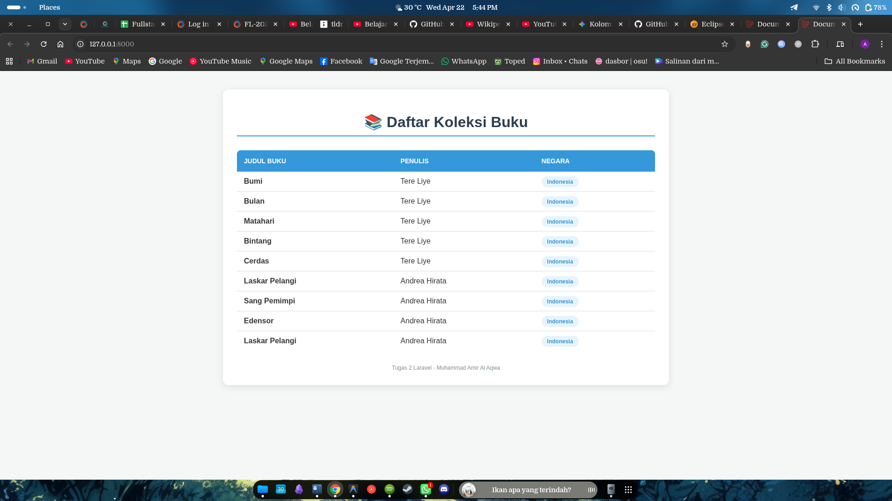

## Identitas Mahasiswa

- **Nama:** Muhammad Amir Al Aqwa
- **Kampus:** STT Terpadu Nurul Fikri
- **Semester:** 6

# Tugas 2 Laravel - Pemrograman Web 2

### Tugas ini mendemonstrasikan implementasi dasar framework Laravel meliputi **Migration**, **Seeder**, **Eloquent Model**, **Controller**, dan **Blade View** dengan studi kasus daftar koleksi buku.

## 🛠️ Prasyarat
- PHP >= 8.2
- Composer
- MySQL/MariaDB

## 📌 Fitur Utama
- **Migration**: Schema database untuk tabel `authors` dan `books`.
- **Seeder**: Pengisian data dummy otomatis untuk 2 Author dan 8 Buku (Termasuk seri Bumi - Tere Liye).
- **Eloquent Relationship**: Relasi One-to-Many antara Author dan Book.
- **UI/UX**: Tampilan tabel responsif dengan CSS internal pada halaman library.

## 📁 Struktur File Penting
- `app/Models/Genre.php`
- `app/Models/Author.php`
- `app/Http/Controllers/LibraryController.php`
- `resources/views/library.blade.php`
- `routes/web.php`

## 💻 Cara Menjalankan
1. **Clone Repository**
   ```bash
   git clone https://github.com/Minkqwqw/Tugas-2-Laravel.git
   cd tugas-2-laravel
   ```
2. **Install Dependencies**
   ```bash
   composer install
   ```
3. **Konfigurasi Environment**
     ```bash
     php artisan key:generate
     ```
4. **Generate App Key**
   ```bash
   php artisan key:generate
   ```
5. **Run Server**
   ```bash
   php artisan serve
   ```
   Akses melalui browser ```http://localhost:8000```

## 📂 Struktur Penting
- app/Models/ : Logika bisnis dan relasi database.
- database/migrations/ : Blueprint struktur tabel.
- database/seeders/ : Pengisian data awal database.
- app/Http/Controllers/LibraryController.php : Penghubung data ke view.
- resources/views/library.blade.php : Tampilan antarmuka user.

## Preview Output

### Hasil Akhir


